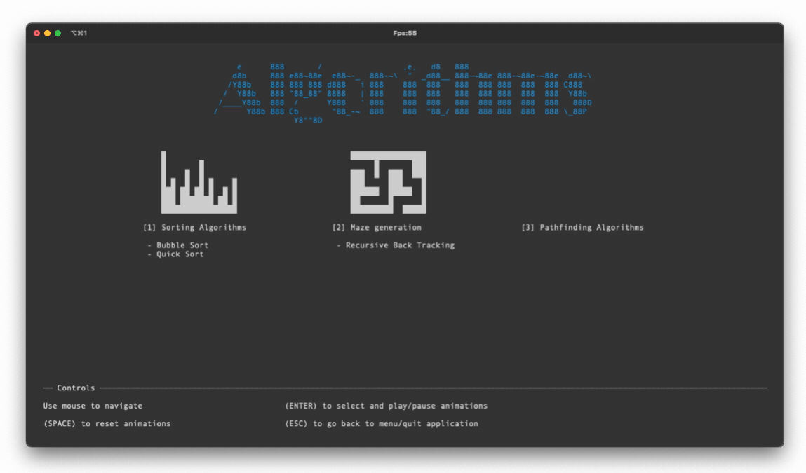
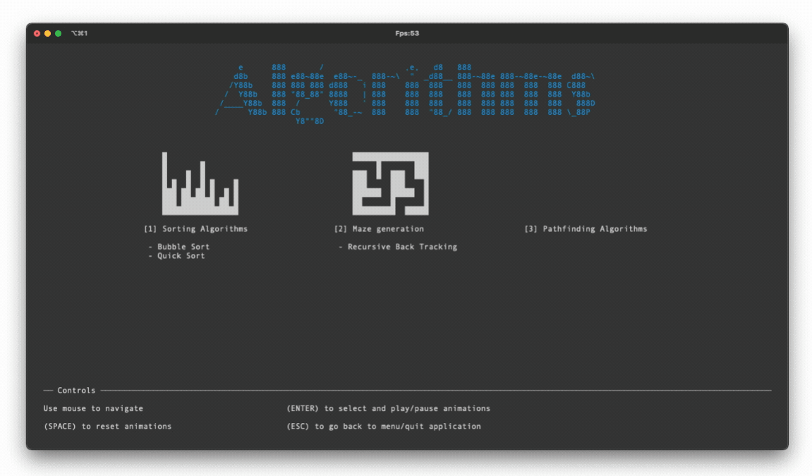
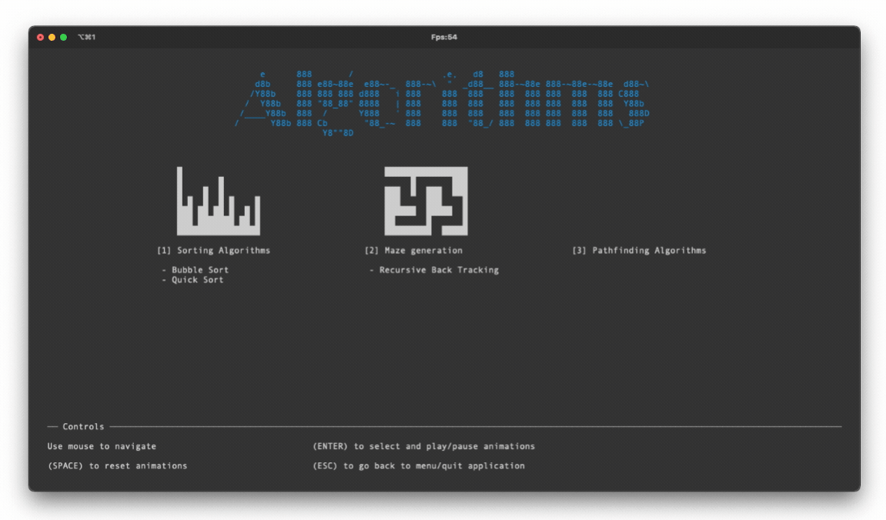
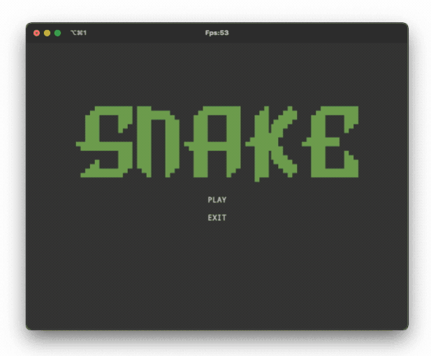

# Demo

## Project work in progress...

> **Current state:** early development, functional

## Contents

1. [How to Use?](#how-to-use)
2. [jTengine](#jtengine)
3. [Demos](#demos)

## How to use?

Checkout the [MAIN repo](#jtengine) just below for more information!!!

## jTengine

Here is the link to the main repo: [jTengine](https://github.com/leonardcser/jtengine)

## Demos

Check out [/visualiserapp](src/visualiserapp) and [/snakegame](src/snakegame). These are for now only proofs of concept and the code is not perfect neither optimised.

**Note:** The following gifs are fixed at 17.5 fps and they have been compressed for page performance.

### Visualiser App

### Snake Game

